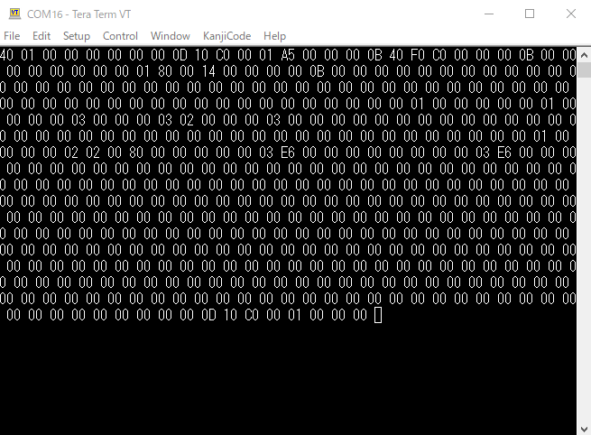
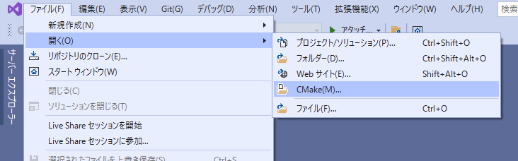
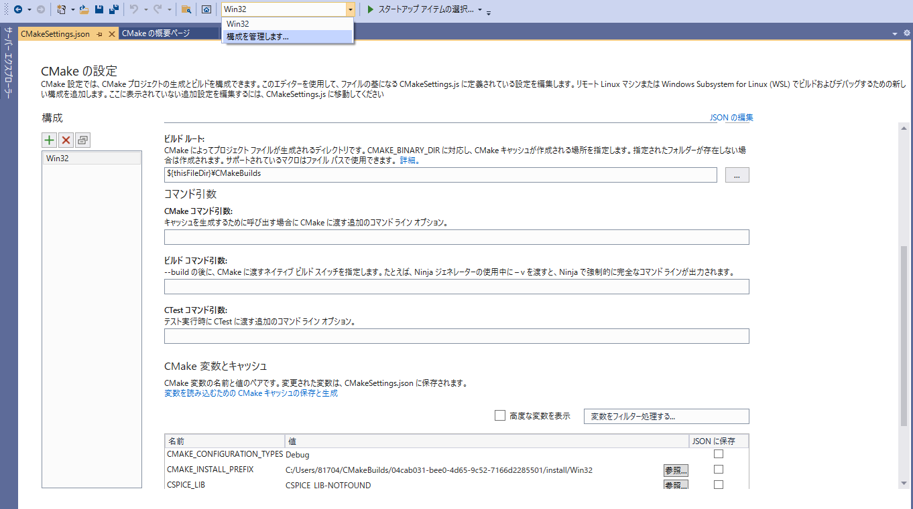
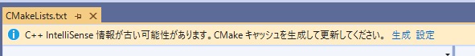
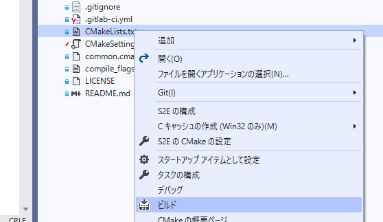

# C2A Raspberry Pi User Sample

## 概要

フライトソフトウェア[C2A](https://github.com/ut-issl/c2a-core)をラズペリーパイ上で動作させるためのUser部のサンプルです。

## ラズペリーパイ実機での実行

ここでは、「Raspberry Pi 4 Model B Rev 1.4」を使用して動作確認をしています。

別の世代の場合、UARTのデバイスファイル名の割り当てやピンアサインが変わってきますのでご注意ください。その場合のデバイスファイル名は、`src/src_user/Settings/port_config.h`を書き換えて指定してください。

また、OSは32bit(armv7l)でRaspberry Pi OSを使用しています。

### UARTの設定

Raspberry Piでは初期状態でUARTが無効化されていますので、有効にします。

`sudo raspi-config`コマンドで設定

`3 Interface Options`>`P6 Serial Port`より

- `Would you like a login shell to be accessible over serial?`を`No`
- `Would you like the serial port hardware to be enabled?`を`Yes`

に設定してください。

### C2Aのビルド

1. `git clone --recursive git@github.com:arkedge/c2a_user_oss_raspi.git` によりクローン。
  C2A userは、C2A coreをsubmoduleとして読み込みますのでrecursiveオプションを付けて取得してください。
1. `mkdir build && cd build && cmake .. && make` によりビルド。

### C2Aの実行

build以下に出来たバイナリを実行すると、C2Aが起動して次のような画面がコンソール上に表示されます。

```
-- Raspberry Pi SAMPLE Flight S/W (H-ON, F-ON) --
BUILD: Feb 22 2022 11:52:05
Git rev: CORE 0x0000000, USER 0x0000000
CYCLE: TOTAL 0131, MODE 0031
MODE: STAT 0, PREV 0, CURR 1
CMD: GS   0, RT   0, Ack   0, Code 0x00, Sts   0

```

また、この状態で適当なUART-USB変換モジュールを用いてteratermからバイナリモードでTXから送られてくる信号を見ると、ラズパイからテレメトリが送られていることが分かります。



## シミュレーション環境S2E (Windows)での実行

### 必要なファイルの準備

次のツリー構成で各ファイルをダウンロードしてください。

```
.
├─ExtLibraries (後述の「ExtLibrariesの用意」に従って準備)
├─FlightSW 
│  └─ c2a_user_oss_raspi (このREADME以下のファイルを置く)
├─s2e-core (s2e-coreのcommit bef17af9b13dbb9095183ba7de7af9d02d8cfe07を置く)
└─s2e-user-for-c2a-core (s2e-user-for-c2a-coreのcommit 0267de2bb840d78ed22c8ae7b5ca33360f1ec132を置く)
```

- [ut-issl/s2e-user-for-c2a-core](https://github.com/ut-issl/s2e-user-for-c2a-core)
- [ut-issl/s2e-core](https://github.com/ut-issl/s2e-core)

### ExtLibrariesの用意

s2e-core内にある、ExtLibrariesについては、[s2e-documents/GettingStarted.md](https://github.com/ut-issl/s2e-documents/blob/main/Tutorials/GettingStarted.md)のチュートリアルに従い用意をお願いします。

用意が完了したら、ExtLibrariesのディレクトリの位置を、ツリーと同じように上の階層にコピーしてください。

> 3. Execute `./scripts/VisualStudio/dowload_cspice_VS32bit.bat` to set up CSPICE library.
>    - **Note:** The script is not completely automatic. Users need to input several simple words.  
>    - If you do not use Windows Visual Studio, or the script does not work well in your environment, please see  [How to download CSPICE Library](https://github.com/ut-issl/s2e-documents/blob/main/General/HowToDwnloadCSPCElibrary.md) and download the CSPICE files by yourself.
> 4. Execute `./scripts/Common/download_nrlmsise00_src_and_table.sh` to download the > atmosphere model table.
>    - If you do not use Windows Visual Studio, or the script does not work well in your environment, please see  [How to download and make NRLMSISE00 Library](https://github.com/ut-issl/s2e-documents/blob/main/General/HowToDownloadNRLMSISE00library.md) and download the NRLMSISE00 files by yourself.
> 4. Execute `./scripts/VisualStudio/make_nrlmsise00_VS32bit.bat` to generate library files for the atmosphere model.

### s2e-user-for-c2a-coreへのパッチの適用

LinuxのUARTはデバイスファイルベースのため、s2e-user-for-c2a-coreに以下のパッチを適用してください。

```diff
diff --git a/src/Simulation/Spacecraft/c2a_core_sample_components.cpp b/src/Simulation/Spacecraft/c2a_core_sample_components.cpp
index 9a9dbbc..362154f 100644
--- a/src/Simulation/Spacecraft/c2a_core_sample_components.cpp
+++ b/src/Simulation/Spacecraft/c2a_core_sample_components.cpp
@@ -21,7 +21,7 @@ C2aCoreSampleComponents::C2aCoreSampleComponents(
 #ifdef USE_C2A
   obc_ = new OBC_C2A(clock_gen, 100);

-  obc_->ConnectComPort(PORT_CH_RS422_MOBC_EXT, 1024, 1024); // UART通信用にとりあえず繋いでおく
+  // obc_->ConnectComPort(PORT_CH_RS422_MOBC_EXT, 1024, 1024); // UART通信用にとりあえず繋いでおく
 #endif
 }

```

### Visual Studio 2019を使用したC2A on S2Eのビルド

ここからはs2e-user-for-c2a-coreを用いてC2A on S2Eをビルドしていきます。

Visual Stduio 2019のメニューで、`開く`>`CMake`から、s2e-coreの中にある`CMakeLists.txt`を開きます。



`構成を管理します`から、CMakeのコマンドライン引数を選び、次の引数を指定してください。

```
-DS2E_CORE_DIR="../s2e-core" -DCSPICE_DIR="../ExtLibraries/cspice" -DNRLMSISE00_DIR="../ExtLibraries/nrlmsise00" -DFLIGHT_SW_DIR="../FlightSW" -DC2A_NAME="c2a_user_oss_raspi" -DUSE_C2A=ON -DUSE_SCI_COM_WINGS=ON
```



その後、ソリューションエクスプローラーから`CMakeLists.txt`を開いてください。

すると、画面のような表示が出ますので、`生成`をクリックしてください。

`CMakeLists.txt`右クリックし、`ビルド`を選択することでビルドできます。



### C2Aの実行

Visual Studioから、ビルドされた`S2E_FOR_C2A_CORE.exe`を実行すると次のような出力が表示されます。

```
Starting simulation...
        Ini file: ../../data/ini/c2a_core_sim_base.ini
Air density model : STANDARD
file open error:Geopotential
degree of GeoPotential set as 0

SimulationDateTime
 2020/1/1 12:00:00
C2A_init: CA_initialize done.

(...以下実機と同様に以下のような表示が続く...)

-- Raspberry Pi SAMPLE Flight S/W (H-ON, F-ON) --
BUILD: Feb 24 2022 17:59:42
Git rev: CORE 0x0000000, USER 0x0000000
CYCLE: TOTAL 0011, MODE 0011
MODE: STAT 1, PREV 0, CURR 1
CMD: GS   0, RT   0, Ack   0, Code 0x00, Sts   0
```

## 使用バージョン情報

この記事では次のコミットのC2A・S2Eで動作を確認しています。

- [ut-issl/s2e-core@bef17af](https://github.com/ut-issl/s2e-core/tree/bef17af9b13dbb9095183ba7de7af9d02d8cfe07)
- [ut-issl/s2e-user-for-c2a-core@0267de2](https://github.com/ut-issl/s2e-user-for-c2a-core/tree/0267de2bb840d78ed22c8ae7b5ca33360f1ec132)
- [ut-issl/c2a-core@76c7f78](https://github.com/ut-issl/c2a-core/tree/76c7f78322b6e76e7c44f57057957dde475ed5a2) (tag: v3.5.0)

